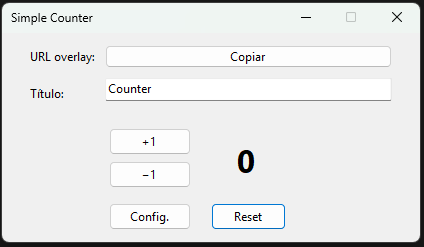

# SimpleCounter

i was tire to rewrite a txt for have a counter on the overlay of OBS so i made something more comfortable

# INSTRUCTIONS

- Add the local HTML file on Designs folder ont your broadcasting software
- Recommended: Width 300 Height 200

# KEYFEATURES
- Hotkey shortcuts
- Font Customization
- Works in the background
